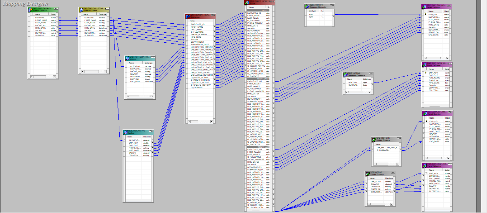
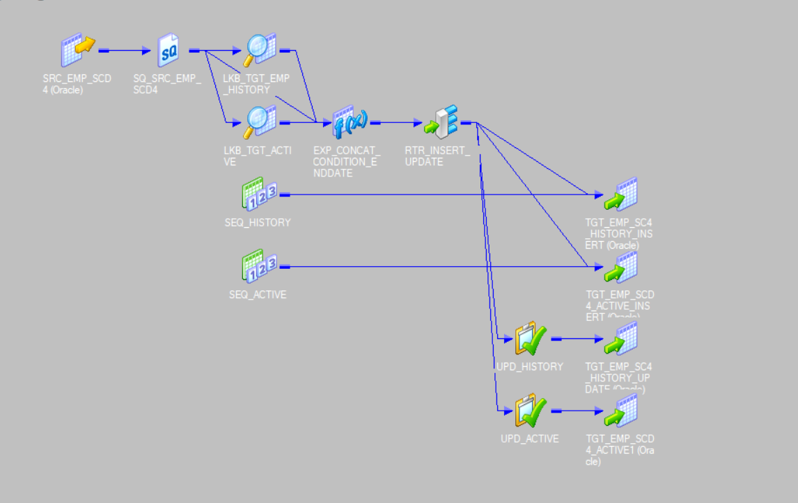
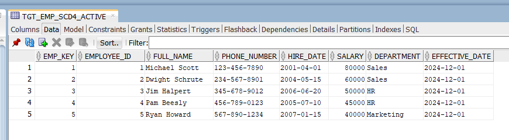
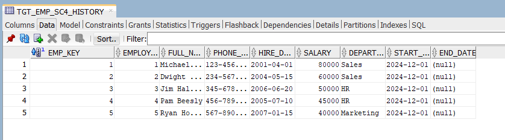
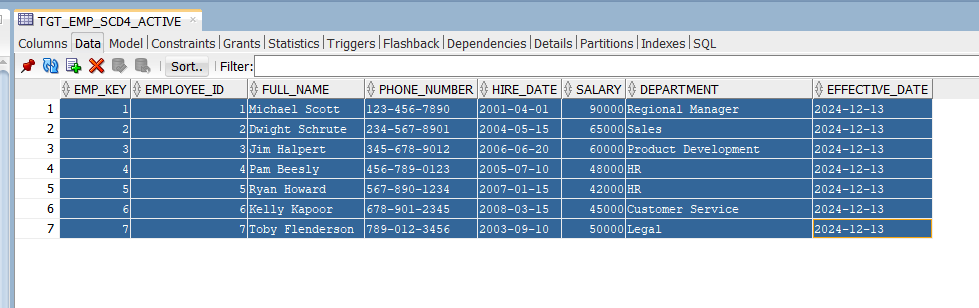
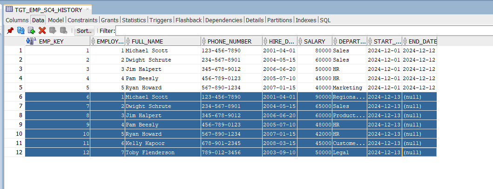
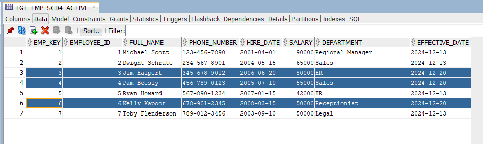
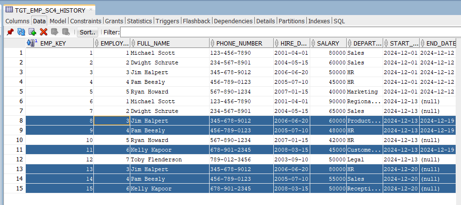

# **SCD Type 4 Implementation Documentation**

## **Overview:**

This documentation describes the implementation of Slowly Changing Dimension (SCD) Type 4, where the active records are stored in one target table and historical records are stored in a separate history table. In this case, we maintain only the most recent record in the active table, and all historical changes are tracked in the history table.

---

### Data Flow Diagram





---

## **Source Table: `SRC_EMP_SCD4`**

| **Column Name**      | **Description**                                           |
|----------------------|-----------------------------------------------------------|
| `employee_id`         | The unique ID for each employee.                          |
| `first_name`          | The first name of the employee.                           |
| `last_name`           | The last name of the employee.                            |
| `phone_number`        | The phone number of the employee.                         |
| `hire_date`           | The date the employee was hired.                          |
| `salary`              | The current salary of the employee.                       |
| `department`          | The department the employee is assigned to.               |
| `submission_date`     | The date when the current record was submitted.           |

---

## **Target Tables:**

### **1. Active Table: `TGT_EMP_SCD4_ACTIVE`**

| **Column Name**      | **Description**                                           |
|----------------------|-----------------------------------------------------------|
| `emp_key`            | Surrogate key for the employee (auto-generated).          |
| `employee_id`        | The unique ID for each employee.                          |
| `full_name`          | The concatenated full name (`first_name || last_name`).   |
| `phone_number`       | The phone number of the employee.                         |
| `hire_date`          | The hire date of the employee.                            |
| `salary`             | The salary of the employee.                               |
| `effective_date`     | The date when the active record became effective.         |

### **2. History Table: `TGT_EMP_SCD4_HISTORY`**

| **Column Name**      | **Description**                                           |
|----------------------|-----------------------------------------------------------|
| `emp_key`            | Surrogate key for the employee (auto-generated).          |
| `employee_id`        | The unique ID for each employee.                          |
| `full_name`          | The concatenated full name (`first_name || last_name`).   |
| `phone_number`       | The phone number of the employee.                         |
| `hire_date`          | The hire date of the employee.                            |
| `salary`             | The salary of the employee.                               |
| `department`         | The department the employee was in.                       |
| `start_date`         | The date when the historical record started.              |
| `end_date`           | The date when the historical record ended.                |

---

## **Mapping Steps**

---

### **1. Source Qualifier:**

The data from the source table (`SRC_EMP_SCD4`) is passed through the Source Qualifier transformation.

---

### **2. Lookup Transformations:**

- **LKB_TGT_EMP_HISTORY:**  
  - Performs a lookup on the history table (`TGT_EMP_SCD4_HISTORY`) with the condition:  

    ```employee_id (source) = employee_id (target)
    ```

  - Returns the following fields from the history table:
    - `phone_number`, `salary`, `department`, `emp_key`, `employee_id`, `end_date`

- **LKB_TGT_ACTIVE:**  
  - Performs a lookup on the active table (`TGT_EMP_SCD4_ACTIVE`) with the condition:  

    ```employee_id (source) = employee_id (target)
    ```

  - Returns the following fields from the active table:
    - `emp_key`, `phone_number`, `hire_date`, `salary`, `employee_id`, `department`

---

### **3. Expression Transformation:**

The following steps occur in the **Expression Transformation** (`EXP_SCD4`):

#### **Input Fields:**

- Fields from the source (`SRC_EMP_SCD4`).
- Fields from `LKB_TGT_EMP_HISTORY` prefixed with `LKB_HISTORY_`.
- Fields from `LKB_TGT_ACTIVE` prefixed with `LKB_ACTIVE_`.

#### **Variable Fields:**

1. **SRC_MD5:**  
   - Calculates the MD5 hash of the concatenated fields `phone_number`, `salary`, and `department` from the source.  

   ```MD5(PHONE_NUMBER || SALARY || DEPARTMENT)
   ```

2. **TGT_HISTORY_MD5:**
Calculates the MD5 hash of the concatenated fields `phone_number`, `salary`, and `department` from the history table.

 ```MD5(LKB_HISTORY_PHONE_NUMBER || LKB_HISTORY_SALARY || LKB_HISTORY_DEPARTMENT)
 ```

3. **TGT_ACTIVE_MD5:**

Calculates the MD5 hash of the concatenated fields phone_number, salary, and department from the active table.

 ```MD5(LKB_ACTIVE_PHONE_NUMBER || LKB_ACTIVE_SALARY ||  LKB_ACTIVE_DEPARTMENT)
 ```

### Output Fields

1. **O_fullname**:
  Concatenates `first_name` and `last_name`.

  ```CONCAT(first_name, last_name)
  ```

2. **O_insert_active**:
  Determines if a new record should be inserted into the active target table.

  ```IIF(ISNULL(LKB_ACTIVE_EMP_KEY), 1, 0)
  ```

3. **O_insert_history**:
  Determines if a new record should be inserted into the history table.

  ```IIF(ISNULL(LKB_HISTORY_EMP_KEY) OR (NOT ISNULL(LKB_HISTORY_EMP_KEY)) AND (SRC_MD5 != TGT_HISTORY_MD5), 1, 0)
  ```

4. **O_update_active**:
  Determines if an existing record in the active table should be updated.

  ```IIF(NOT ISNULL(LKB_ACTIVE_EMP_KEY) AND (SRC_MD5 != TGT_ACTIVE_MD5), 1, 0)
  ```

5. **O_update_history:**
 Determines if an existing record in the history table should be updated.

 ```IIF(NOT ISNULL(LKB_HISTORY_EMP_KEY) AND (SRC_MD5 != TGT_HISTORY_MD5), 1, 0)
 ```

6. **O_enddate**:
  Sets the `end_date` for records that are moving to the history table.

  ```ADD_TO_DATE(SUBMISSION_DATE, 'DD', -1)
  ```

### 4. Router Transformation

The fields from the Expression Transformation are routed to the following groups in the Router Transformation:

- **INSERT_HISTORY**:
  When `O_insert_history = 1`, the record should be inserted into the history table.

- **INSERT_ACTIVE**:
  When `O_insert_active = 1`, the record should be inserted into the active table.

- **UPDATE_HISTORY**:
  When `O_update_history = 1`, the record in the history table should be updated.

- **UPDATE_ACTIVE**:
  When `O_update_active = 1`, the record in the active table should be updated.

### 5. Insert Paths

- **Insert Path for History Table**:
  - **Fields Mapped**:
    - `employee_id`, `O_fullname`, `phone_number`, `hire_date`, `salary`, `department`, `submission_date`.
  - The `emp_key` is generated by a sequence generator.
  - `end_date` is set to `NULL` for new history records.

- **Insert Path for Active Table**:
  - **Fields Mapped**:
    - `employee_id`, `O_fullname`, `phone_number`, `salary`, `department`, `submission_date`.
  - The `emp_key` is generated by a different sequence generator.

### 6. Update Paths

- **Update Path for History Table**:
  - **Fields Mapped**:
    - `LKB_HISTORY_emp_key` to `emp_key`.
    - `O_enddate` to `end_date`.
  - The record is updated in the history table using the Update Strategy Transformation (`UPD_HISTORY`) with the update expression `DD_UPDATE`.

- **Update Path for Active Table**:
  - **Fields Mapped**:
    - `LKB_ACTIVE_emp_key` to `emp_key`.
    - `salary`, `phone_number`, `department`, `submission_date` to corresponding fields.
  - The record is updated in the active table using the Update Strategy Transformation (`UPD_ACTIVE`) with the update expression `DD_UPDATE`.

## 7. Test Cases

### Test Case 1 - First Load

This is the first load where 5 employees are inserted into the target table.

| employee_id | first_name | last_name | phone_number | hire_date  | salary | department | submission_date |
|-------------|------------|-----------|--------------|------------|--------|------------|-----------------|
| 1           | Michael    | Scott     | 123-456-7890 | 2001-04-01 | 80000  | Sales      | 2024-12-01      |
| 2           | Dwight     | Schrute   | 234-567-8901 | 2004-05-15 | 60000  | Sales      | 2024-12-01      |
| 3           | Jim        | Halpert   | 345-678-9012 | 2006-06-20 | 50000  | HR         | 2024-12-01      |
| 4           | Pam        | Beesly    | 456-789-0123 | 2005-07-10 | 45000  | HR         | 2024-12-01      |
| 5           | Ryan       | Howard    | 567-890-1234 | 2007-01-15 | 40000  | Marketing  | 2024-12-01      |

### Target After First Run

the five records will be inserted in both the active and history tables

 **Active Table**


 **History Table**


### Test Case  - Second Load

In the Second load, the records for Michael, Dwight, Jim ,Ryan and Pam are updated , and two new employees are inserted.

| employee_id | first_name | last_name | phone_number | hire_date  | salary | department        | submission_date |
|-------------|------------|-----------|--------------|------------|--------|-------------------|-----------------|
| 1           | Michael    | Scott     | 123-456-7890 | 2001-04-01 | 90000  | Regional Manager  | 2024-12-13      |
| 2           | Dwight     | Schrute   | 234-567-8901 | 2004-05-15 | 65000  | Sales             | 2024-12-13      |
| 3           | Jim        | Halpert   | 345-678-9012 | 2006-06-20 | 60000  | Product Development | 2024-12-13      |
| 4           | Pam        | Beesly    | 456-789-0123 | 2005-07-10 | 48000  | HR                | 2024-12-13      |
| 5           | Ryan       | Howard    | 567-890-1234 | 2007-01-15 | 42000  | HR                | 2024-12-13      |
| 6           | Kelly      | Kapoor    | 678-901-2345 | 2008-03-15 | 45000  | Customer Service  | 2024-12-13      |
| 7           | Toby       | Flenderson| 789-012-3456 | 2003-09-10 | 50000  | Legal             | 2024-12-13      |

### Target After Second Run

for the `history` table the old records for  Dwight, Ryan,Jim, Pam and Michael their enddate will be update from null to the submission_date - 1
and their new records will be added with end_date is null , and the two new records for kelly and toby will be added also with end_date is null

for the `acive` table recorde of Michael , Jim and Pam will be Updated with Their new values and the two New Employees Kelly and Toby will be added

**Active Table**



**History Table**



### Test Case 3 - Third Load

In the third load, the departments and salaries , department for  Jim, Pam, and kelly are updated.

| employee_id | first_name | last_name | phone_number | hire_date  | salary | department        | submission_date |
|-------------|------------|-----------|--------------|------------|--------|-------------------|-----------------|
| 1           | Michael    | Scott     | 123-456-7890 | 2001-04-01 | 90000  | Regional Manager  | 2024-12-13      |
| 2           | Dwight     | Schrute   | 234-567-8901 | 2004-05-15 | 65000  | Sales             | 2024-12-13      |
| 3           | Jim        | Halpert   | 345-678-9012 | 2006-06-20 | 80000  | HR                | 2024-12-20      |
| 4           | Pam        | Beesly    | 456-789-0123 | 2005-07-10 | 55000  | Sales             | 2024-12-20      |
| 5           | Ryan       | Howard    | 567-890-1234 | 2007-01-15 | 42000  | HR                | 2024-12-13      |
| 6           | Kelly      | Kapoor    | 678-901-2345 | 2008-03-15 | 50000  | Receptionist      | 2024-12-20     |
| 7           | Toby       | Flenderson| 789-012-3456 | 2003-09-10 | 50000  | Legal             | 2024-12-13      |

### Target After Third Run

for the `history` table the old records for Jim, Pam and kelly their enddate will be update from null to the  `submission_date - 1`
and their new records will be added with end_date is null.

and the their records in the `active` table will be updated with new values

**Active Table**


**History Table**



### Conclusion

This documentation describes the full flow for managing both the active and historical records for SCD Type 4 in an Informatica PowerCenter implementation. The active records are stored in the `TGT_EMP_SCD4_ACTIVE` table, and the historical records are stored in the `TGT_EMP_SCD4_HISTORY` table. Updates and inserts are processed based on changes in the source data.
